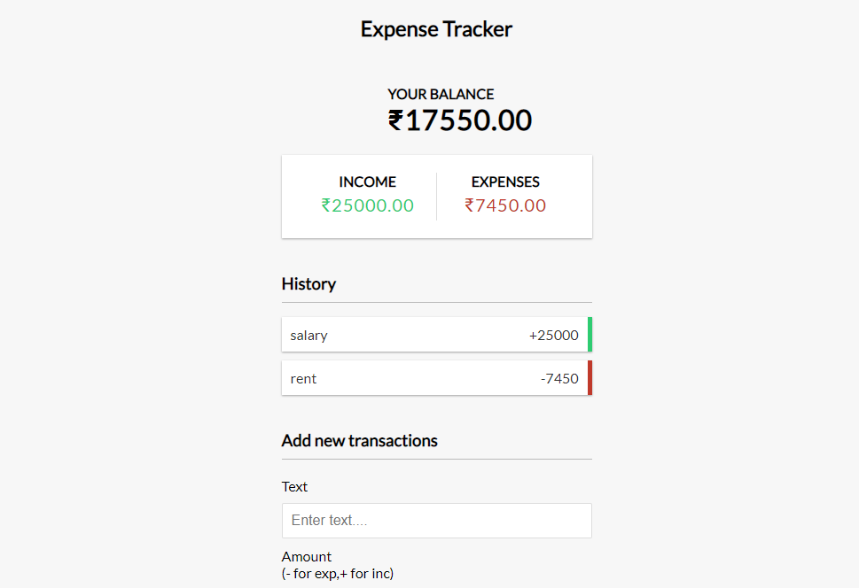

# Expense Tracker
> keep track of income and expenses. Add and remove items and save to local storage.
***
## Project Specification
- Create UI for projects
- Display transaction items in DOM
- Show balance, expenses, income totals
- add new transactions and reflect in total
- Delete items from DOM
- Persist to local storage.

  

