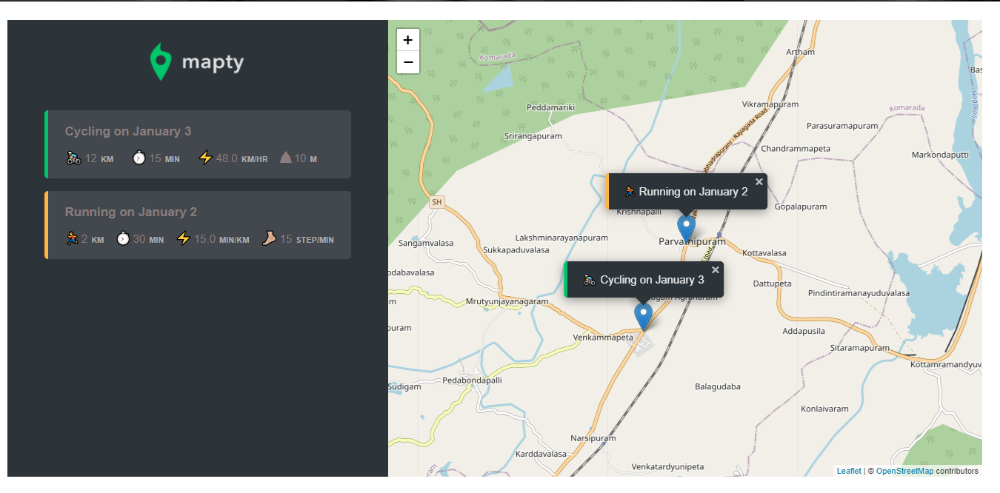
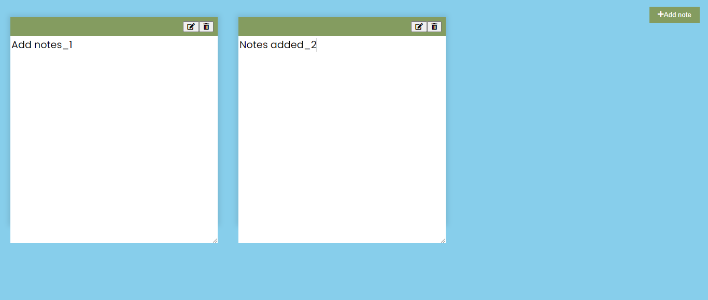
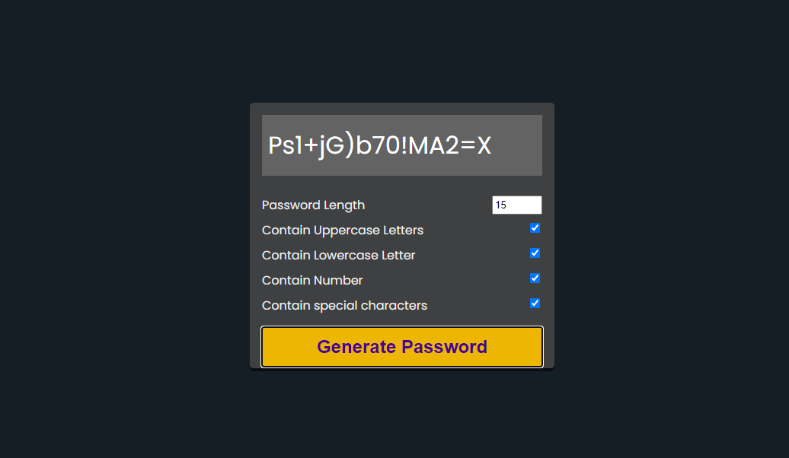
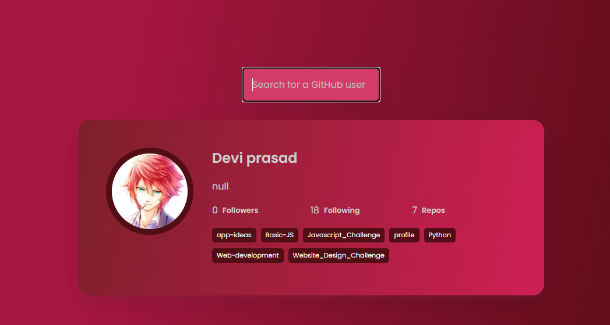
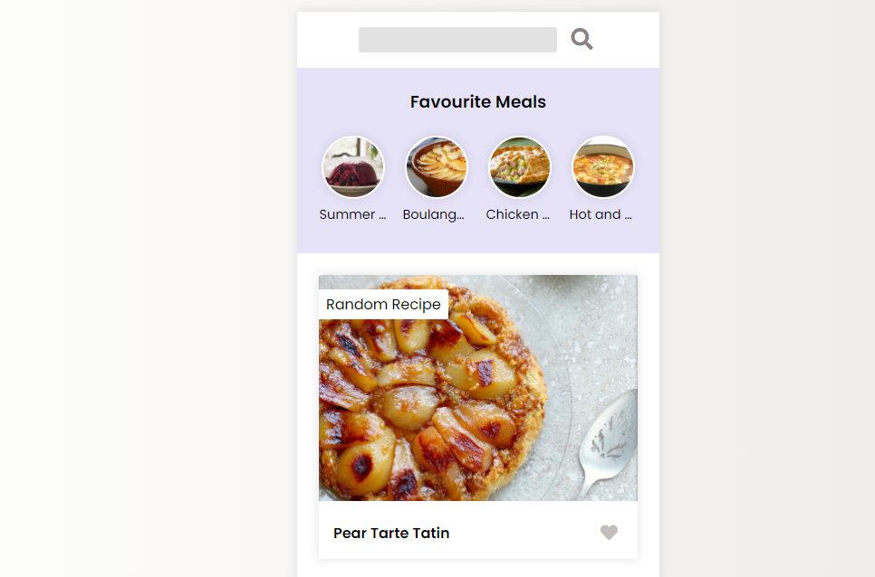

# Javascript
The repository holds the javascript applications, projects, portfolio's created using javascript as core language.
>All the appllications are either learned or created after a series of practise.
***
#### My projects

> A responsive monthly budget tracking application with simple yet quirky animations.

  

 

> A workout + map featured app to monitor workout flow

  

 

> A player vs computer dice game with variable end score.

  

 

> A responsive add & remove note making application.

  

 

  

 

  

 

  

 

